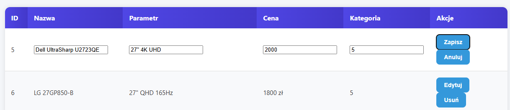
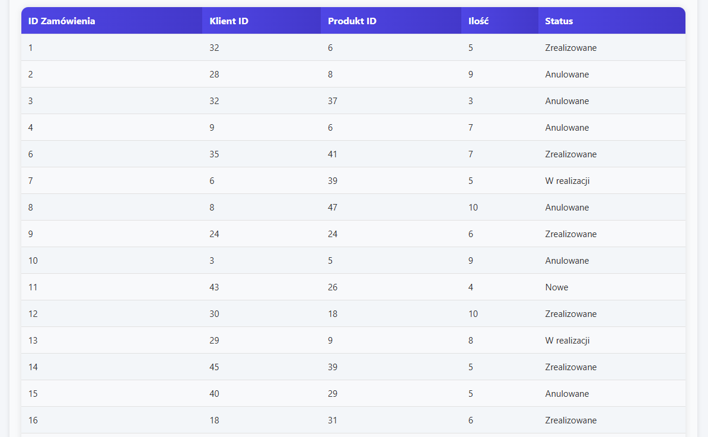
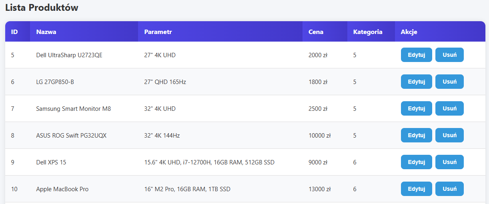
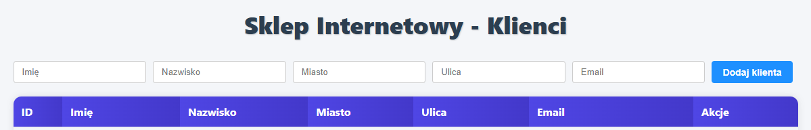

#  Aplikacja webowa – Obsługa zamówień (Laravel + React)

##  Opis projektu
Aplikacja służy do obsługi zamówień w sklepie internetowym.  
Umożliwia:
- **Klientom** – przeglądanie katalogu produktów, składanie zamówień oraz podgląd historii zakupów,  
- **Administratorom** – zarządzanie produktami, klientami oraz zmianę statusu zamówień.  

Celem projektu jest automatyzacja procesu obsługi zamówień, integracja z bazą danych PostgreSQL oraz możliwość analizy sprzedaży w czasie rzeczywistym.

---

##  Stos technologiczny
- **Backend:** PHP 8 + Laravel  
- **Frontend:** React + Vite  
- **Baza danych:** PostgreSQL (hurtownia danych)  

---

##  Funkcjonalności


- przeglądanie listy produktów, 
- składanie nowych zamówień,  
- sprawdzanie historii zamówień.  
- dodawanie, edycja i usuwanie produktów,

 
  
- zarządzanie klientami,  
- zmiana statusu zamówień (`Nowe`, `W realizacji`, `Zrealizowane`, `Anulowane`).
  
 

---

## 🗄 Struktura bazy danych
Główne tabele:
- `dim_klient (klient_id, dane klienta)`  
- `dim_produkt (produkt_id, nazwa, parametr, cena, id_kategoria)`  
- `dim_kategoria (kategoria_id, nazwa kategorii)`  
- `dim_czas (czas_id, data)`  
- `fakt_zamowienie (zamowienie_id, klient_id, produkt_id, czas_id, status, ilość)`  

---

##  Endpointy API (Laravel)

| Metoda | Endpoint | Opis |
|--------|----------|------|
| `GET`  | `/api/produkty` | Lista produktów |
| `POST` | `/api/zamowienia` | Złożenie zamówienia |
| `GET`  | `/api/zamowienia/{klient_id}` | Historia zamówień klienta |
| `PATCH`| `/api/zamowienia/{id}` | Zmiana statusu zamówienia |
| `CRUD` | `/api/klienci` | Zarządzanie klientami |

---

## 🖥️ Widoki (React)
- Lista produktów (z możliwością edycji przez administratora)
  
  
  
- Dodawanie i usuwanie klientów

  
  
- Panel zamówień (zmiana statusów)

 
    
- Historia zamówień klienta  
- Responsywne UI (desktop, tablet, telefon)  

---

## Instalacja i uruchomienie

### Backend (Laravel)
```bash
# Wejście do katalogu projektu
cd sklep-backend

# Instalacja zależności
composer install

# Skopiowanie pliku konfiguracyjnego
cp .env.example .env

# Generowanie klucza aplikacji
php artisan key:generate

# Migracje i seedy
php artisan migrate --seed

# Uruchomienie serwera
php artisan serve
```

Frontend (React + Vite)
# Wejście do katalogu frontendu
cd sklep-frontend

# Instalacja zależności
npm install

# Uruchomienie aplikacji
npm run dev

Aplikacja dostępna pod adresami:

Backend (API): http://localhost:8000

Frontend (React): http://localhost:5173
